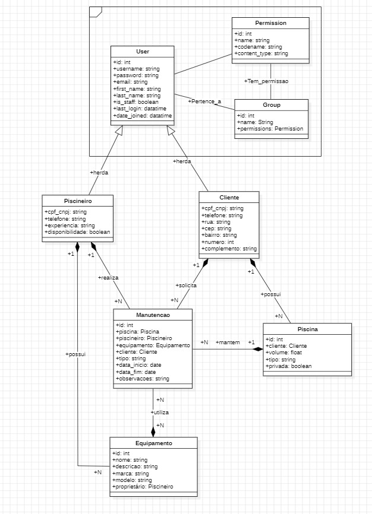

# contratar_piscineiro

## Objetivo do Projeto
Este projeto é uma aplicação web desenvolvida em *Django* para gerenciar o processo de *contratação de piscineiros* e o controle de *manutenções de piscinas*.  

O sistema permite:  
- Cadastrar clientes e suas piscinas.  
- Cadastrar piscineiros (profissionais responsáveis pela manutenção).  
- Registrar equipamentos utilizados.  
- Controlar serviços de manutenção realizados.  

Com isso, o projeto funciona como um sistema de *gestão de serviços de piscina*, permitindo organizar clientes, profissionais, equipamentos e manutenções em um só lugar.

## Como Executar Localmente
1. git clone https://github.com/oguilherme04/contratar_piscineiro.git

2. cd contratar_piscineiro

## Integrantes do Grupo
1. DIAMILI SOIANE PEREIRA DA SILVA

2. GUILHERME ANDRADE SILVA

3. IVAN TEIXEIRA RODRIGUES JUNIOR

## Instruções de Acesso
Criar um superusuário (opcional, para acessar o admin):
 - python manage.py createsuperuser

## Link do Vídeo
 - https://youtu.be/C468hPHX5Ww

## Diagrama
 - 
